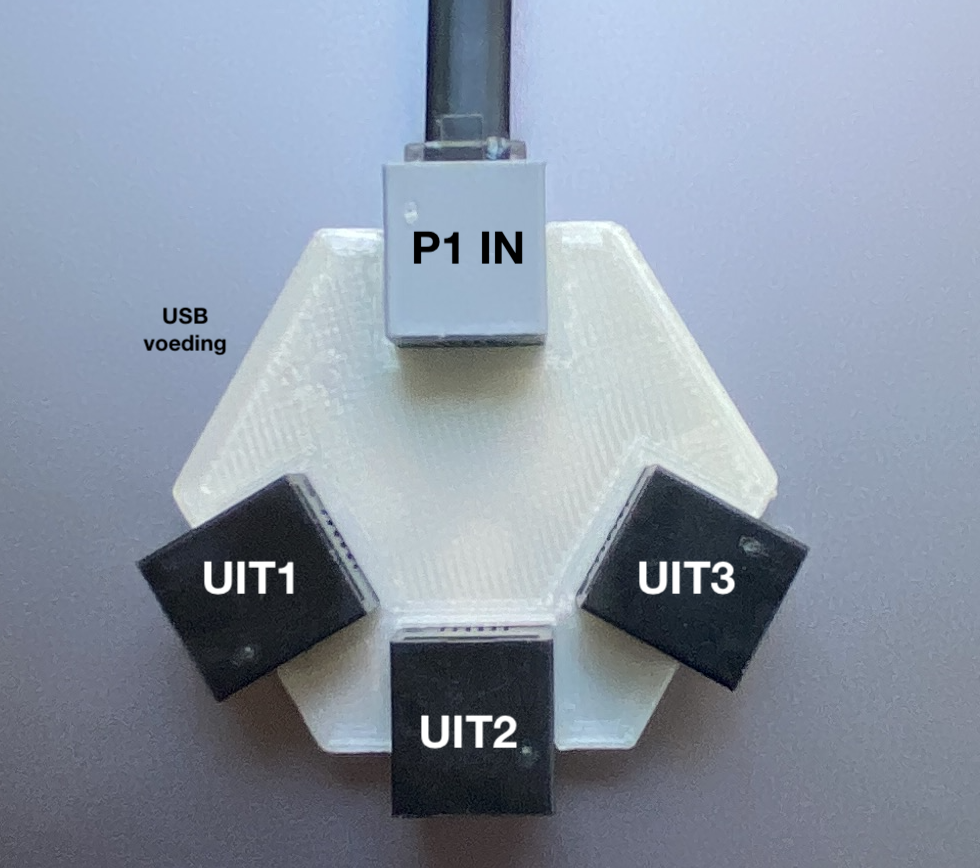

# **Handleiding P1 Bridge / Extender / Splitter** 

De splitter is uitgerust met versterkers die van stroom worden voorzien door slimme meter of adapter. 
Er is geen processor en daardoor ook geen firmware of gebruikersinterface aanwezig.

 
 
**Aansluiten op slimme meter** 
Met de meegeleverde RJ12 kabel kan de splitter via het _grijze_ aansluitblok (P1 IN) op de splitter worden gekoppeld met de slimme meter. 
 
Eventueel kan er nog een usb adapter worden aangesloten op de splitter. Dit is noodzakelijk voor versie 2/3 slimme meters en afhankelijk van de belasting op de uitgang van de splitter ook nodig voor versie 4/5 slimme meters. 
 
Op elke willekeurige uitgang (zwarte aansluitblokjes) kan een apparaat worden aangesloten. Volgorde maakt niet uit.  

>**TIP** De USB adapter mag een oude smartphone of tablet adapter zijn of een usb aansluiting die voorhanden is in de meterkast (bv van een NAS/Router). Bijna alle usb adapters voldoen (5V/5Watt is prima).

**Betekenis van de LED's** 
- De rode led naast het grijze aansluitblokje geeft aan dat er spanning op de splitter staat. Is deze uit dat zal de splitter niet werken. 
- De blauwe ledjes naast de zwarte aansluitblokjes geven per uitgang aan of het afnemende toestel een data pakket (DTR) vraagt. Zo kunt u zien of het aangesloten apparaat actief is.  

**Specificaties** 
- voor elke slimme meter in NL / BE / Lux / DE / DK 
- 1 RJ12 ingangspoort
- 3 RJ12 uitgangspoorten; galvanisch gescheiden en maximaal 50mA / 16V per poort
- usb micro aansluiting voor additionele voeding
- elke uitgang heeft een 5volt voeding (deze komt van slimme meter of usb micro aansluiting)
- P1 bridge vraag continu een datapakket op; afhankelijk van de slimme meter versie komt de data tussen de 1 en 10 seconde

