# **ESPHome Waterlezer dongle**

Als de Watermeter dongle voorzien is van ESPHome firmware is de integratie met Home Assistant zeer eenvoudig.
Hieronder de stap voor stap integratie met Home Assistant.

>**ESPHOME pre-installed**<br>
>De dongle is uitgerust met ESPHome inclusief Watermeter yaml configuratie.

**Aansluiten en opnemen in Home Assistant**<br>
De stappen om de waterlezer dongle aan te sluiten op uw netwerk en daarna op te nemen in Home Assistant staan hieronder.

1) Sluit een usb adapter aan op de dongle
2) monteer de sensor op de watermeter
3) Koppel de dongle aan uw Wifi netwerk
4) Configureer de dongle in Home Assistant
5) Opgeven beginstand
6) Historische gegevens
 
**1. USB Adapter aansluiten**<br> 
Sluit een 5V USB adapter aan op de usb micro aansluiting aan de zijkant van de dongle door middel van een USB micro kabel.</br>

>**USB adapter**<br>
>De USB adapter mag een oude smartphone of tablet adapter zijn of een usb aansluiting die voorhanden is in de meterkast (bv van een NAS/Router). Bijna alle voedingen voldoen (5V/5Watt is prima).

**2. Monteer de sensor op de watermeter**<br> 
Watermeters met een metalen plaatje op de kleine wijzer zijn geschikt voor deze set. Het is zaak om de sensor recht boven deze wijzer te plaatsen zonder dat er lucht/plakband tussen de sensor en de wijzer zit. Gat er tussen zo klein mogelijk.
Ook dient de sensor zo te zitten dat deze 1 keer per omwenteling een signaal opneemt. Dit kan je aan de sensor zien doordat het rode lampje gaat branden. Sensor zit normaal gesproken recht boven deze wijzer maar dan iets verschoven van het midden van deze wijzer.
Maak de sensor vast met meegeleverde klittenband of met de sensor houder, zie onderstaande montage wijze.


>**TIP**<br>
>Zet de kraan een beetje open om te checken of de sensor goed zit
 
**3. Koppel Dongle aan uw Wifi netwerk**<br>
Na aansluiten van sensor en adapter is het zaak om de dongle te koppelen aan uw wifinetwerk. Hiervoor bouwt de dongle een eigen Wifi hotspot op. Deze hotspot is te herkennen door de Wifinaam **waterlezer**.

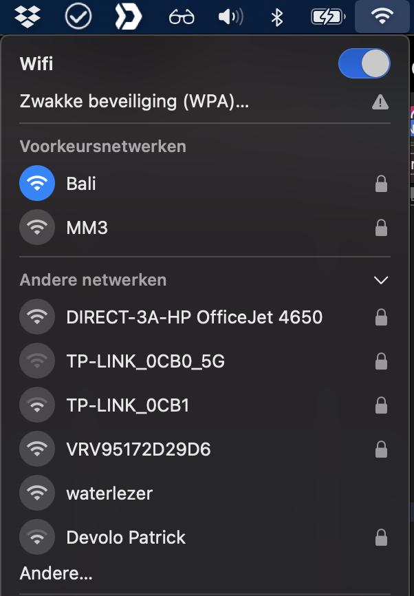

Zorg dat je met je computer of mobiel toestel contact maakt met dit netwerk, door hier op te klikken. Automatisch wordt een scherm getoond waarin de WifiManager te zien is. Zie onderstaande plaatje.

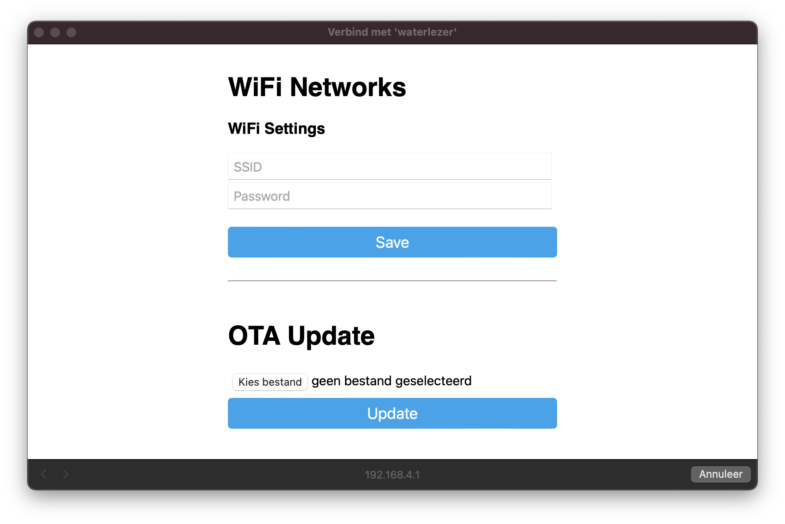

Ook het tonen van deze popup kost tijd. Is deze er na 30 seconden nog niet dan kunt u zelf naar dit scherm te gaan door deze url te openen in uw browser: [http://192.168.4.1](http://192.168.4.1)

1. Vul bij SSID uw netwerknaam in en bij Password uw netwerkwachtwoord
2. Druk op &quot;Save&quot;
3. De dongle zal op nieuwe opstarten en u kunt het scherm sluiten en de computer verbinden met uw thuis netwerk.

Vanaf dit moment zal de dongle te vinden zijn via: [http://waterlezer.local/](http://waterlezer.local/)

**3. Configureer de dongle in Home Assistant**<br>
Zodra de dongle verbonden is met uw netwerk zal deze in de auto discover modus zichtbaar zijn in Home Assistant.

3.1. Automatisch zichtbaar<br>
Voer onderstaande stappen uit in Home Assistant Instellingen > Apparaten & Diensten.<br>
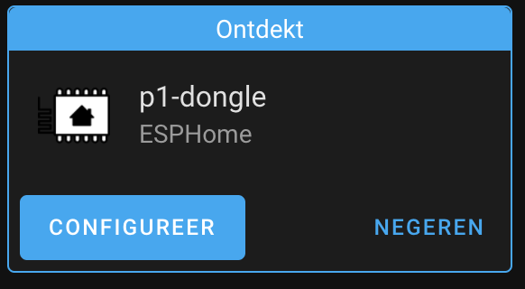<br>
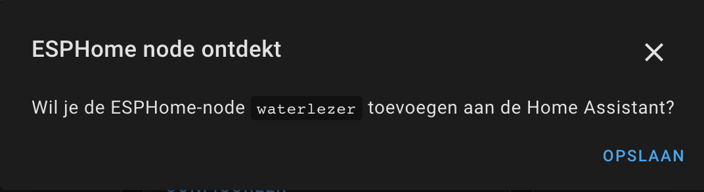<br>
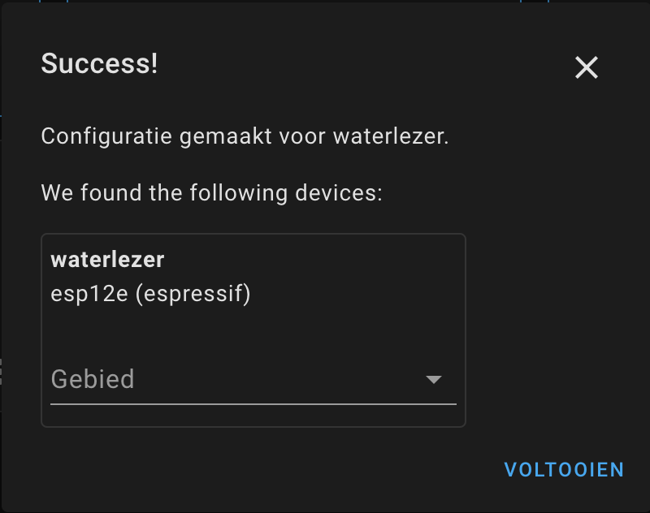<br>
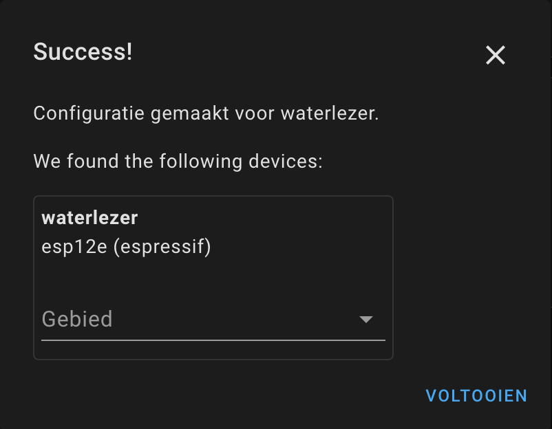<br>
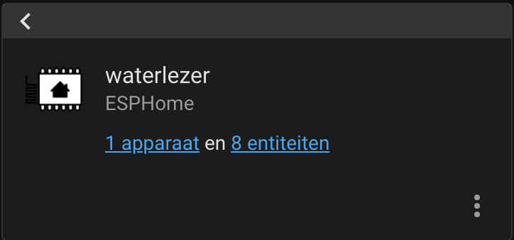<br>
<br>
3.2. Handmatig toevoegen</br>
Zodra deze niet zichtbaar is kan deze met de hand toegevoegd worden in Instellingen > Apparaten & Diensten (Add Integration > ESPHome).
Indien de ESPHome nog niet bestaat in de integratie pagina dient deze toegevoegd te worden door rechtsonder op de + te drukken en te zoeken naar ESPHome
Voer onderstaande stappen uit.<br>
<br>
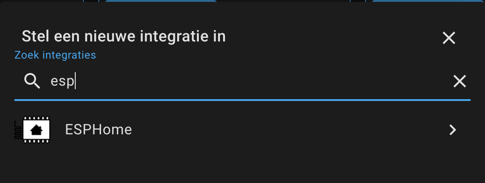<br>
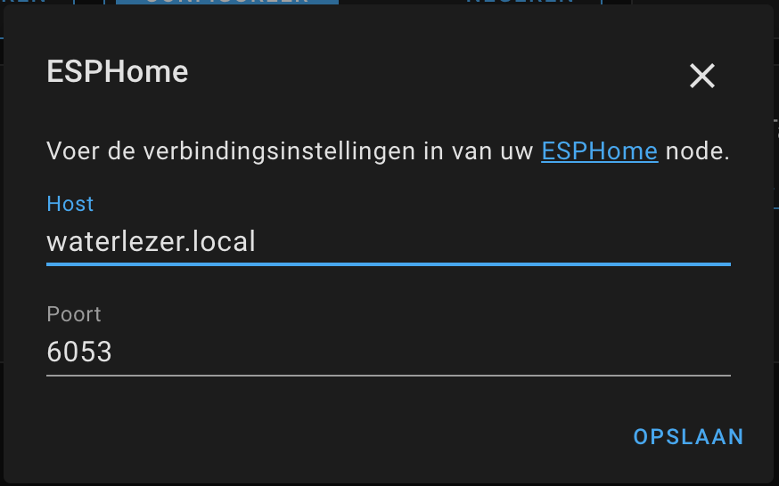<br>
<br>
<br>
<br>

>**TIP**<br>
>mocht waterlezer.local niet werken haal dan de dongel even 5 seconden uit de slimme meter of koppel de usb adapter los. Bij het opnieuw starten zal de dongle zich weer kenbaar maken.

**5. Opgeven beginstand**<br>
De watermeter wordt uitgelezen door bij elke ronde van de kleine wijzer 1 puls te versturen. Dit is in de meeste gevallen 1 liter water. Nu moet wel eerst de beginstand opgegeven worden van de watermeter. 
Dit kan eenvoudig via Home Assistant door onderstaande stappen te volgen.<br>
<br>
a) ga in Home Assistant naar Ontwikkelhulpmiddelen > Services<br>
b) zoek daar op "waterlezer" waardoor de service esphome.waterlezer_set_water_reading te zien is<br>
c) vul de beginstand van de watermeter in en druk op AANROEPEN SERVICE<br>
<br>
Zie scherm hieronder als voorbeeld.<br>
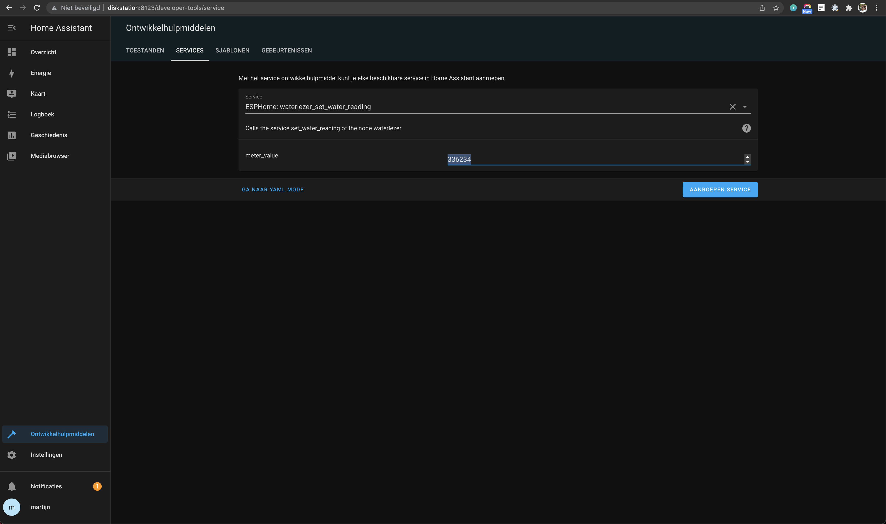<br>

Als het allemaal goed is gegaan is de dongle voorzien van een startstand. Zie onderstaande voorbeeld.
<br>

**6.Historische gegevens**<br>
Neem onderstaande configuratie op in de configuration.yaml. En verwerk deze in de dashboards van Home Assistant na reload/herstart van HA.<br>

```
utility_meter:  
  waterverbruik_kwartier:
    source: sensor.watermeter_total
    cycle: quarter-hourly
  waterverbruik_uur:
    source: sensor.watermeter_total
    cycle: hourly
  waterverbruik_dag:
    source: sensor.watermeter_total
    cycle: daily    
  waterverbruik_week:
    source: sensor.watermeter_total
    cycle: weekly
  waterverbruik_maand:
    source: sensor.watermeter_total
    cycle: monthly
  waterverbruik_kwartaal:
    source: sensor.watermeter_total
    cycle: quarterly
  waterverbruik_jaar:
    source: sensor.watermeter_total
    cycle: yearly          
```

**OPTIONEEL ESPhome Dashboard**</br>
Beheer van de dongle via het ESPhome dashboard. 
Hieronder is de module te zien.<br>
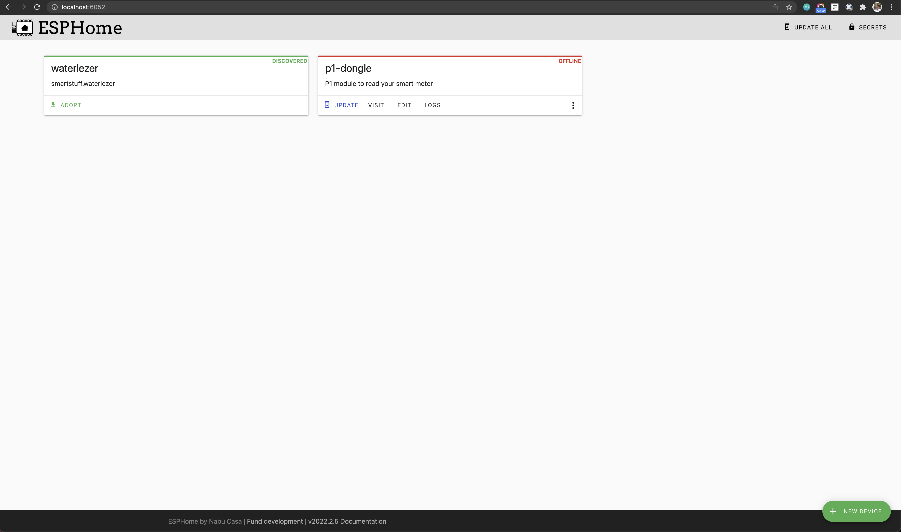<br>

Indien deze niet zichtbaar is kan deze toegevoegd worden door op [+ NEW DEVICE] knop te klikken rechtsonder aan. Volg dan de stappen hieronder.<br>
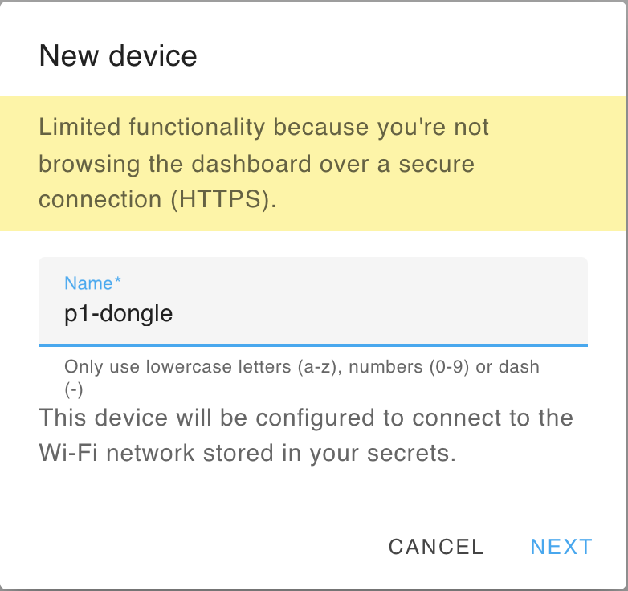<br>
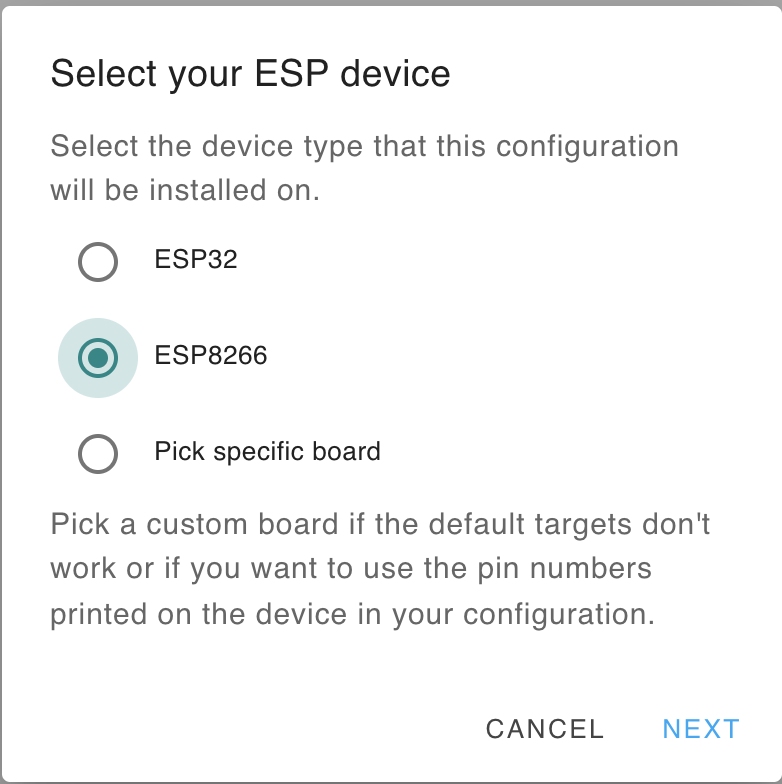<br>

Zelf de configuratie aanpassen kan eenvoudig zie "Zelf aanpassingen maken in de configuratie".
<br>

# **Zelf aanpassingen maken in de configuratie**<br>
In de ESPHome dashboard waarin u zelf de diverse modules kunt beheren kunt u de dongle zien, toevoegen en bewerken.
Onder Edit kan de configuratie worden aangepast. In het bestand [waterlezer.yaml](waterlezer.yaml) kunt u de standaard configuratie zien.

# **Flashen**<br>
Voor het flashen heeft u een USB - TTL adapter nodig. Op J2 (onderkant) zitten de aansluitingen voor deze interface. 
De pinout van de v3.3 hardware is hieronder te zien.

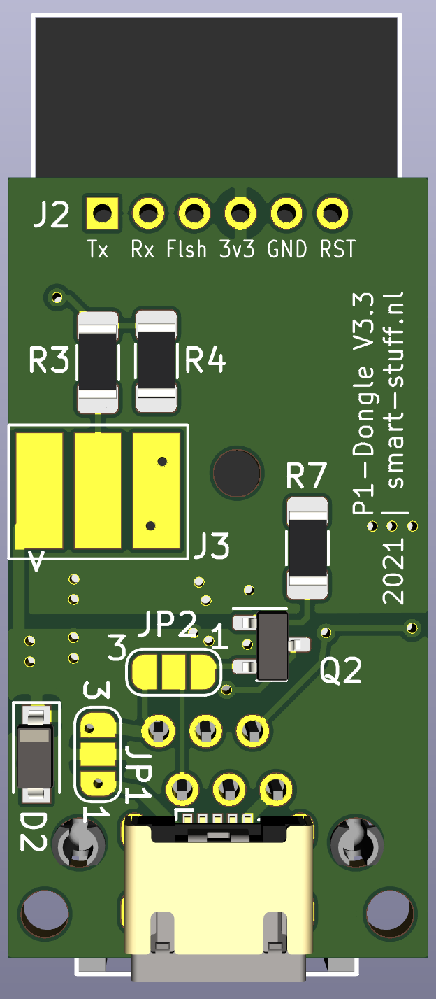

1. RX
2. TX
3. Flash (vierkante pad / Rode pijl); Flash naar GND en opnieuw opstarten om in de program mode te komen
4. 3.3Volt
5. GND
6. Reset = GND